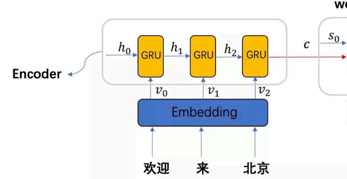
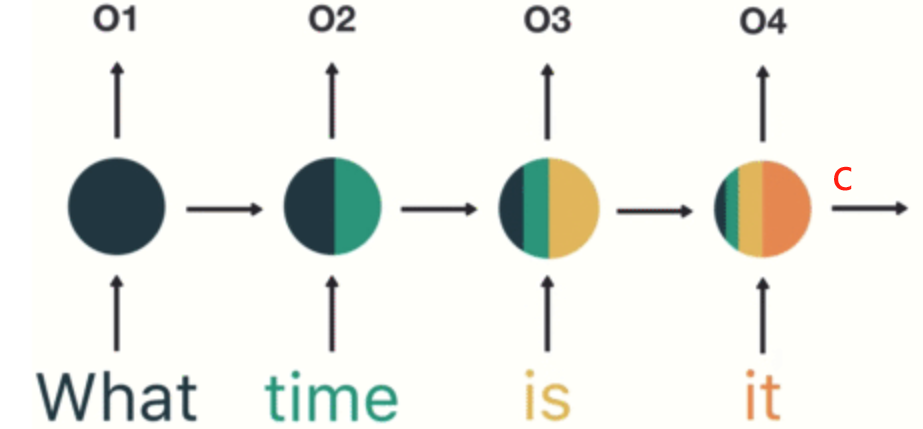
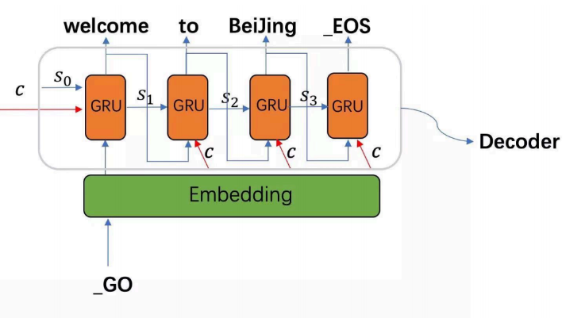

#  手搓一个Seq2Seq模型

在这个模块,将为大家详细讲解NLP入门必须要懂的Seq2Seq模型,注意力机制是什么以及如何将注意力机制融入到Seq2Seq模型中

## 模型分类

我们可以根据输入输出的结构来对传统NLP模型进行分类，大致可以分为以下四种类别：

1.  1 vs N
2.  N vs 1
3.  N vs N
4.  N vs M

其中，数字和字母表示模型输入或输出的词/字符数量。

他们分别对应的场景如下:

1. **1 vs N**（单输入，多输出）：文本生成(给一字,生成一篇对应主题的文章), 翻译任务(翻译一个词)
2. **N vs 1**（多输入，单输出）: 分类任务(给一段话,看看这段话输入什么类别)
3. **N vs N**（多输入，多输出）: 用来做古诗词续写(输入窗前明月光, 让模型输出下一句)
4. **N vs M**（多输入，多输出，长度不同）：这个就很通用了, 可用于文本生成, 翻译, 聊天对话等

我们现在用的最多的一类模型就是N vs M, 而Seq2Seq也就是这一类模型的典型代表之一。

## Seq2Seq介绍

Seq2Seq是一种多输入多输出的模型结构，适用于许多实际应用场景，是NLP领域最经典的模型之一。即使是在当前流行的Transformer框架中，我们依然能看到Seq2Seq的影子。下面是Seq2Seq的结构。

Seq2Seq由两个组件组成:

1. Encode层
2. Decode层

接下来我将为大家介绍这两个组件。

### Encode解码器

编码器负责将输入序列（例如，一句话的单词序列）逐步编码成一个固定大小的向量表示。编码器通常由一系列递归神经网络（如RNN,LSTM或GRU）层组成，逐个处理输入序列的元素，并通过隐藏状态来逐步积累上下文信息。最后一个隐藏状态包含了整个输入序列的信息，作为压缩后的输入序列表示，这一向量会传递给解码器。

如图所示，这是一个编码器结构，由嵌入层和循环神经网络组成。它的输入是一句话，输出为一个n维向量，用于表示该句子的语义。整个过程被称为编码，具体步骤如下：

1. 对句子进行分词。
2. 构建词汇表。
3. 将句子中的每个词转化为对应的词汇表序号。
4. 通过Embedding层将这些序号映射为向量。
5. 将向量输入到循环神经网络中进行信息提取。
6. 最后，输出一个隐藏状态编码 c，作为句子的语义表示。

下面是一个具体例子:

假设输入句子为“我爱学习”。

1. **分词**：将句子分成“我”、“爱”、“学习”。
2. **构建词汇表**：假设词汇表中“我”为1，“爱”为2，“学习”为3。
3. **转换为序号**：句子转化为序号序列1,2,3。
4. **Embedding映射**：通过Embedding层，将序号1,2,3映射为向量序列。
5. **循环神经网络**：将向量序列输入RNN/LSTM/GRU提取信息。
6. **生成编码**：得到的隐藏状态编码 c,  即为“我爱学习”的语义表示。

关于最后隐藏状态 ccc 所包含的语义，可以参考下图。最后的 c 就是包含句子 "what time is it" 的语义向量。

### Decode解码器

解码器的主要作用是根据目标生成我们期望的结果。它通过分析输入信息，逐步生成符合目标要求的输出内容，确保生成的结果与预期保持一致。结构如下:

解码器的输入包括三个部分：编码器最终生成的隐藏语义向量 ccc、开始符号的向量，以及初始化的中间语义。最终输出则是我们想要的目标结果。以图中示例为例，最终输出是句子 "欢迎来北京" 的英语翻译。整个过程称为解码。具体步骤如下：

1. 对输入句子进行编码，得到语义向量 c。
2. 构建一个输入起始符（例如，" |start|" 符号）。
3. 对起始符号进行Embedding处理。
4. 初始化一个中间语义 $S_0$。
5. 将中间语义和 c 拼接，得到整体的隐含语义输出。
6. 在每一步中，GRU 接收上一个时间步的输出、上一个时间步的中间语义，以及 c 拼接后的语义。
7. 最终，将每个步骤的输出拼接在一起，形成解码结果。

以上就是整个解码器的运作过程。

## 注意力机制

